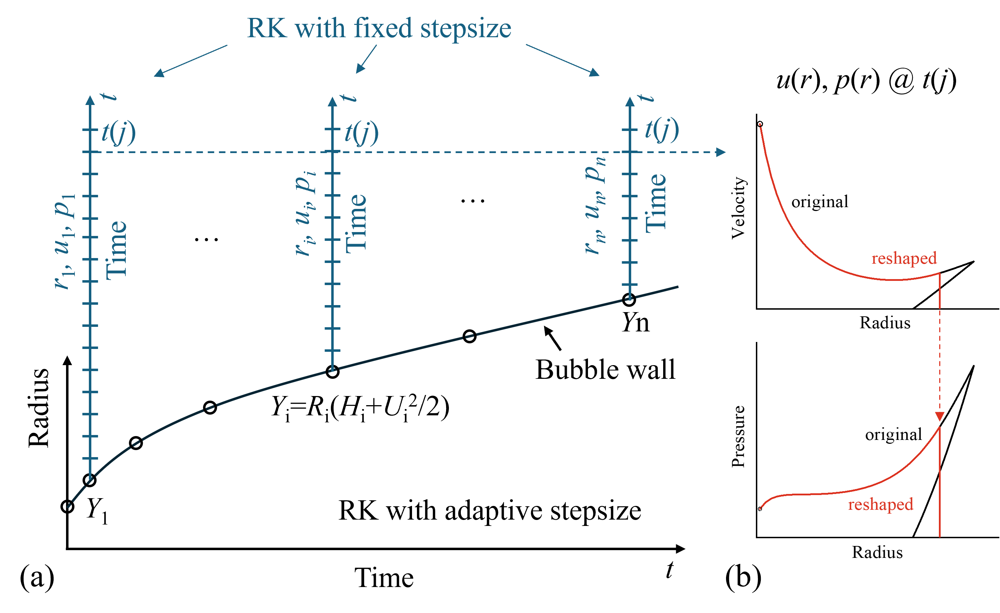
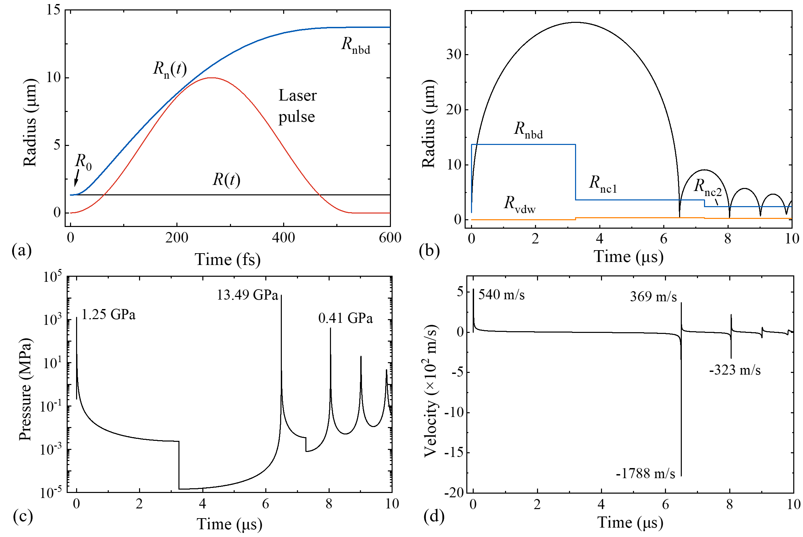
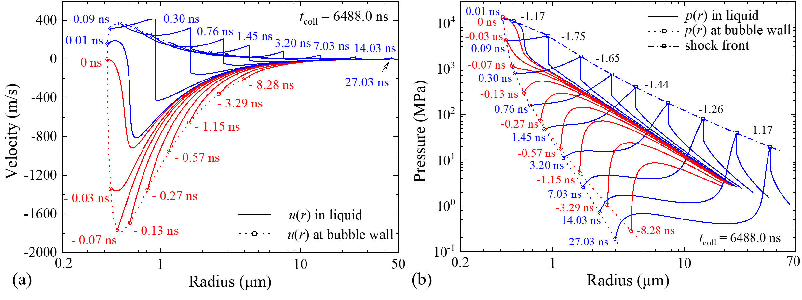
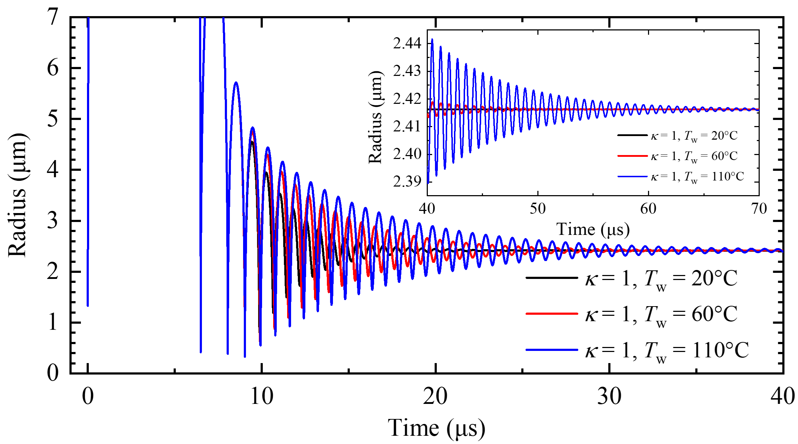
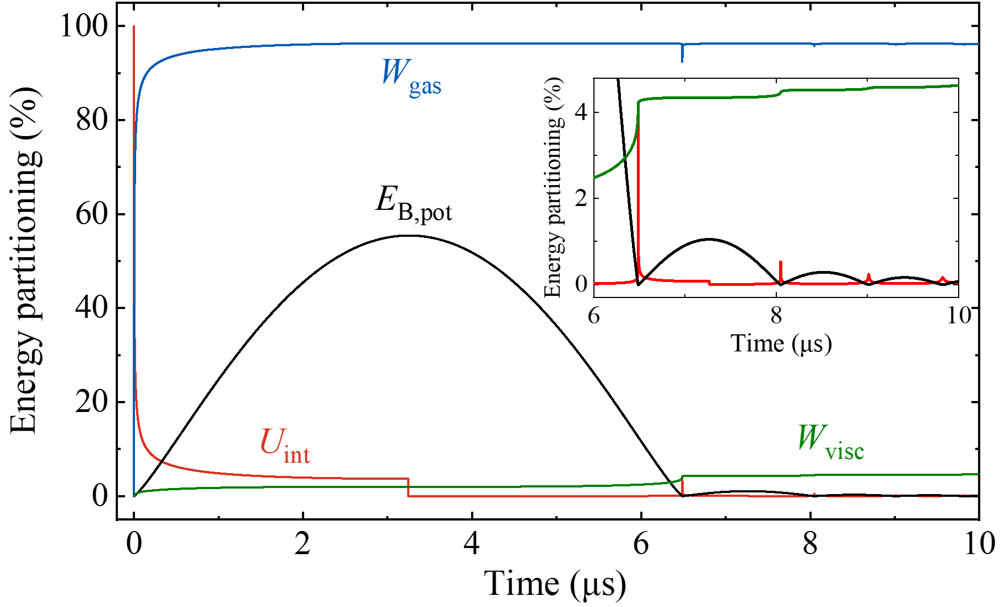
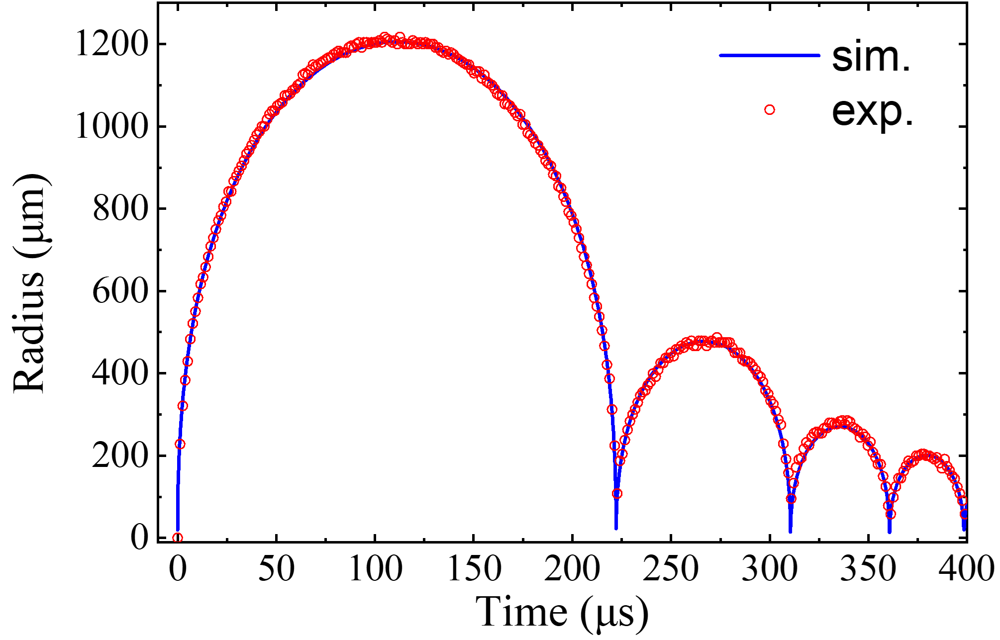

  

# Summary
LIBDAR is a Matlab toolbox to simulate **L**aser-**i**nduced **B**ubble **D**ynamics and **A**coustic **R**adiation, as the name of the toolbox is abbreviated for. Laser-induced cavitation bubble plays a crucial role in laser material processing within liquid environments and in biomedicine and biophotonics, where it enables precise surgery on cells and within transparent tissues. It involves localized energy deposition by laser pulses that results in plasma formation, acoustic radiation, which often evolves into a shock wave, and bubble dynamics. The LIBDAR software serves to provide a comprehensive numerical toolbox to analyze the physical effects of laser-induced bubble dynamics and acoustic radiation.

*The key features of LIBDAR are:*

- Bubble dynamics using the widely used Gilmore model that considers the local changes in the density and speed of sound in a compressible medium and is applicable to trans-/supersonic velocities. 

- Transition of early nonlinear oscillations (adiabatic) to late linear oscillations (isothermal) considering temperature-dependent surface tension and viscosity.

- Finite width of the laser pulse and pulse duration-dependent energy deposition that strongly influence the inertial confinement of the bubble, the peak pressure and velocity of the bubble.

- Particle velocity behind the shock front as plasma rapidly expands during the laser pulse (the generalized jump-start condition).

- Implicit consideration of heat/mass transfer at the bubble wall during bubble oscillations via tuning *R*n.

- Temporal tracking of energy partitioning and tabulated energy balance for the bubble life.

- Acoustic radiation of the bubble in a compressible medium based on the Kirkwood-Bethe hypothesis.

- Novel shock front reshaping algorithm that deals with multi-valued curves based on conservation of momentum.

- Visualization of shock wave propagation in animation and selection of “shock-photos” at queried time instants.

- Consideration of the finite compression of bubble content upon collapse via van der Waal’s hard core.

- Implementation of extra hard core for studying nano-micro bubbles around gold nanoparticles or organic melanosome particles.

- User-friendly, simulation and visualization in one environment, quick-start with one “Run”-click.

# **Algorithms**
The dynamics of laser-induced bubble is simulated using the well-known Gilmore model, which considers the local changes in the density and speed of sound in a compressible medium and assumes spherical symmetry. The model is composed of coupled ordinary differential equations (ODEs), which are solved using the Runge-Kutta scheme with adaptive time steps. Temporal evolution of bubble radius *R*, bubble wall velocity *U*, and pressure at the bubble wall *P* are available as output. Derivative quantities such as enthalpy *H* can then be calculated.

Acoustic radiation of the bubble is calculated based on the Kirkwood-Bethe (KB) hypothesis, which expresses that the quantity *y* = *r*(*h*+*u*2/2) propagates outward along a “characteristic”, traced by a point moving with velocity *c* + *u*. Here, *c* is the local velocity of sound in the liquid, *u* is the local liquid velocity and *h* is the enthalpy. The KB hypothesis leads to a set of ODEs. Numerical solutions of the ODEs with the bubble radius *R*, the bubble wall velocity *U* and the quantity *Y* = *R*(*H* + *U*2/2) as initial conditions yields the velocity and pressure distribution in the liquid along one characteristic. Solution of the equation for many initial conditions, i.e. along many characteristics, allows computation of *u* and *p* for a network of points (*r*, *t*). To determine *u*(*t*) and *p*(*r*) at a certain time *t*(*j*), one has to collect a set of points at the time instant *t*(*j*) from this network. To synchronize the time coordinates among the characteristics, numerical calculations of ODEs are performed using the Runge-Kutta scheme with fixed step size.

When the bubble pressure in high, *u*(*t*) and *p*(*r*) profiles in the liquid become steeper with time until a shock front is formed. Afterward, the calculations yield multi-valued curves because they do not consider the energy dissipation at the shock front. The ambiguities have no physical meaning but indicate the presence of a discontinuity. The position of the shock front can be determined based on the conservation of momentum, which is defined by a vertical line in the *u*(*r*) plots cutting off the same area from the ambiguous part of the curve as that added below the curve. The location of the front determined in the *u*(*r*) plots are then transferred to the *p*(*r*) plots. Repeating the processes at different time instants leads to a time series of shock wave propagation in the liquid.

A sketch of the algorithms is illustrated in the following figure and the Matlab functions to perform the algorithms are contained in the “core functions” folder in the repository.

_Figure 1. A sketch of the main algorithms used in the toolbox. (a) Bubble dynamics are solved using the Runge-Kutta (RK) scheme with adaptive time steps, and acoustic emission are solved using RK with fixed step size. Propagation of “characteristics” is illustrated as the vertical lines starting with the quantity Yi at bubble wall, with i = 1 to n. (b) Multi-valued shock front curves need to be reshaped according to the conservation of momentum in u(r) curves and then the location of shock front is transferred to the p(r) curves._

# **Repository Structure**
- 'core functions’ contains the essential functions to simulate laser-induced bubble dynamics and acoustic emission. The purpose, usage and the input&out arguments are explained at the top of each file.

- 'docs' contains relevant publications that describe the theory and formulas behind the core algorithms.
- 'examples' contains test scripts for the algorithms to reproduce the results in the publications.
- 'expData' contains experimentally determined radius-time data, used for comparison with simulations.
- 'misc' contains auxiliary functions used in simulations.
- 'results' stores simulation results that includes temporal evolution of bubble dynamics, temporal tracking of energy partitioning, and tabulated energy balance in .xlsx format. Animated acoustic emissions are stored in .avi format.
- ‘figures’ stores the figures for the README.md and for paper.md
- 'paper' stores the files for paper.md and the related bibliography in paper.bib
- The [CODE_OF_CONDUCT.md](https://github.com/X-X-Liang/LIBDAR/blob/main/CODE_OF_CONDUCT.md) file outlines the code of conduct for this repository.
- The [LICENSE.txt](https://github.com/X-X-Liang/LIBDAR/blob/main/LICENSE.md) file contains the GNU General Public License v3.0.
- The [README.md](https://github.com/X-X-Liang/LIBDAR/blob/main/README.md) file is the file you are right now reading.

# **Requirements**

The toolbox requires a working base installation of Matlab, with some additional functions from the Signal Processing Toolbox, such as *findpeaks*(). Matlab is available for Linux, MacOS and Windows, and can be purchased from [Mathworks](https://www.mathworks.com/). Running LIBDAR on Matlab requires:

- Base installation of Matlab (has been tested with versions 2018b, 2023b and 2024b that are installed on Windows 8, 10 and 11)

- Signal Processing Toolbox

# **Quick Start Guide**

## Installation

Download the LIBDAR toolbox and add the toolbox folder, or at least the “examples” folder to the Matlab path. Run the scripts under the "examples" folder to see exemplary usage of the different algorithms. 

## Examples

The purpose of the “examples” folder is to help the users familiarize themselves with the usage of the toolbox and to reproduce the results in the publications with a single “Run”-click. Publications include works from our own group, as well as works from other groups that follow our approach. The portfolio of the examples will be expanded when more works are published using the toolbox in the future.

- “*bubble_dyn_energy_partitioning_Rmax_36um_example.m*”, one can simulate bubble dynamics, track the energy partitioning and establish energy balance for a 36 μm-sized bubble induced by a fs laser, part of the results in the Ref. [1].

- “*bubble_dyn_acoust_rad_Rmax_36um_example.m*”, one can simulate bubble dynamics and acoustic emission at bubble expansion and collapse for a 36 μm-sized bubble induced by a fs laser, part of the results in the Ref. [1].

- “*surface_tension_viscosity_temperature.m*”, a small code to produce the temperature-dependent surface tension and viscosity for water, part of the results in the supplementary of Ref. [1].

- “*bubble_dyn_energy_partitioning_Rmax_5um_example.m*”, one can simulate bubble dynamics, track the energy partitioning and establish energy balance for ≈ 5 μm-sized bubbles induced by fs to ns pulses, part of the results in the Ref. [2].

- “*bubble_dyn_acoust_rad_Rmax_5um_example.m*”, one can simulate bubble dynamics and acoustic emission during bubble expansion for ≈ 5 μm-sized bubbles induced by fs to ns pulses, part of the results in the Ref. [2].

- “Inertial_confinement_example.m”, one can reproduce the results on inertial confinement degree in the Ref. [2].

- “*bubble_dyn_acoust_rad_Rmax_1200um_example.m*”, one can simulate bubble dynamics and acoustic emission at bubble expansion and collapse for a 1.2 mm-sized bubble induced by a ns laser, and compare *R*(*t*) data with experimental results from the Ref. [3].

_Figure 2. Time evolution of the increase of Rn(t) during the pulse from R0 to Rnbd (a), bubble radius (b), internal pressure (c) and bubble wall velocity (d). Simulations were performed for a 36 μm-sized bubble induced by a fs laser pulse. Figures are taken and reorganized from Ref. [1]._

_Figure 3. Shock wave emission after optical breakdown for the parameters of Fig. 2, with velocity distributions in the liquid, u(r), at different times in (a), and the corresponding pressure distribution, p(r), presented in (b). Figures are taken and reorganized from Ref. [1]._

_Figure 4. (a) Evolution of the velocity distribution in the liquid during the late stage of bubble collapse and during the bubble’s rebound for the parameters of Fig. 2. Upon rebound, the flow around the expanding bubble collides with the still incoming flow from outer regions, and a shock front develops within about 50 ps and 750nm propagation distance that continues to exist even in the far field. (b) Evolution of the pressure distribution in the liquid. Figures are taken and reorganized from Ref. [1]._

_Figure 5. Simulated *R*(*t*) curves for the 36-μm bubble covering the transition from nonlinear to linear oscillations and late bubble oscillations. Simulations were performed for initially adiabatic conditions with *κ* =4/3 followed by isothermal conditions after the maximum of the third oscillation, with *κ* =1 for *T*w = 20 °C, 60 °C and 100 °C. Temperature-dependent surface tension σ and viscosity μ at the corresponding temperature are used. Figures are taken from Ref. [1]._

_Figure 6.  Time evolution of the internal bubble energy Uint capable of doing work, the total amount of work Wgas done on the liquid by the expanding gas, the fraction Wvisc done for overcoming viscosity, and the potential bubble energy EB,pot after laser-induced breakdown for a fs pulse. Figures are taken and reorganized from Ref. [1]._

_Figure 7. Comparison of bubble radius as a function of time between simulation and experimental data to the fourth oscillation. The 1.2-mm bubble is generated by a ns laser pulse. Experimental data are taken from Ref. [3]._

# Major Updates
Version 1.1 introduces ambient-pressure-dependent liquid properties, enabling simulations of bubble dynamics and shock emission beyond standard atmospheric conditions.

# Contributing
Contributions to the toolbox are very welcome; bug reports, suggestions for changes, datasets, new algorithms - anything you think is relevant.

# License and Copyright
LIBDAR is under the copyright of its developer and made available as open-source software under the terms of the GNU General Public License v3.0.

# Citing LIBDAR
If you use the LIBDAR toolbox for your scientific work, please consider citing it appropriately:

X.-X. Liang and A. Vogel, *LIBDAR: A Matlab toolbox for laser-induced bubble dynamics and acoustic radiation*, https://doi.org/10.5281/zenodo.18504019, (2026).

# Acknowledgements
Sincere gratitude to Prof. Günther Paltauf for sharing initial ideas/codes for the toolbox that is instrumental in shaping the foundation of the project. The development of LIBDAR was supported by U.S. Air Force Office of Scientific Research (FA9550-15-1-0326, FA9550-18-1-0521, FA9550-22-1-0289).

## **References**

[1] X.-X. Liang, N. Linz, S. Freidank, G. Paltauf, and A. Vogel, *Comprehensive analysis of spherical bubble oscillations and shock wave emission in laser-induced cavitation*, J. Fluid. Mech. 940, A5 (2022). https://doi.org/10.1017/jfm.2022.202

[2] X.-X. Liang and A. Vogel, *Influence of inertial confinement on laser-induced bubble generation and shock wave emission*, arXiv:2501.13749 (2025). https://doi.org/10.48550/arXiv.2501.13749.

[3] H. Wen, Z. Yao, Q. Zhong, Y. Tian, Y. Sun, and F. Wang, *Energy partitioning in laser-induced millimeter-sized spherical cavitation up to the fourth oscillation*, Ultrason. Sonochem. 95, 106391 (2023). https://doi.org/10.1016/j.ultsonch.2023.106391.
